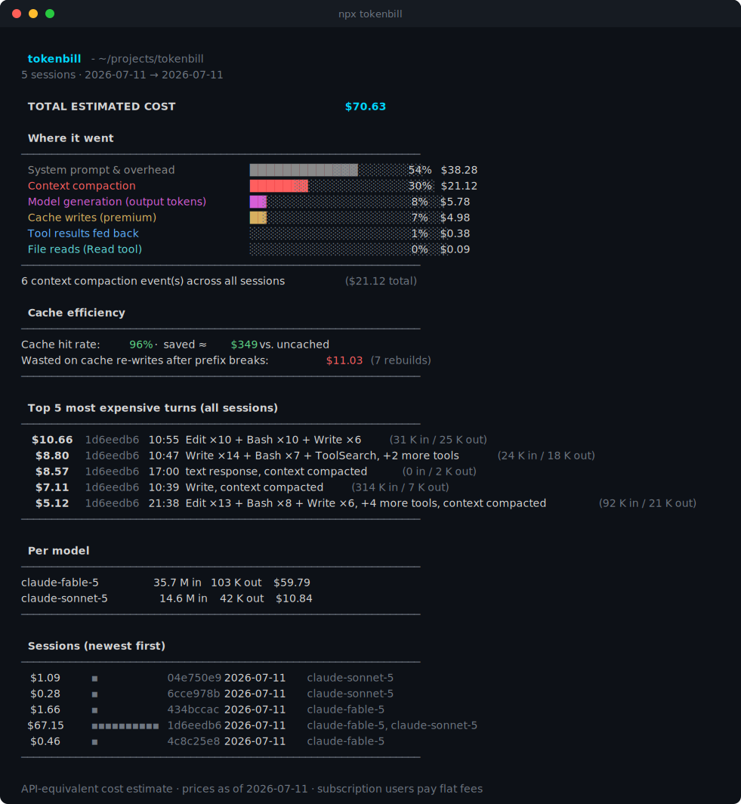

# tokenbill

**Where did my AI budget go?**

Claude Code sessions cost real money and you get zero visibility into why.
`tokenbill` reads the session logs already on your disk and gives you the bill,
itemized. No network calls, no config, no account.



```
$ npx tokenbill

  tokenbill - session 1d6eedb6 · 29m · claude-fable-5

  TOTAL ESTIMATED COST                              $32.25

  Where it went
  ──────────────────────────────────────────────────────────────────
  System prompt & overhead           ████████████████░░░░░░░░  65%   $21.04
  Context compaction                 █████░░░░░░░░░░░░░░░░░░░  20%    $6.29
  Model generation (output tokens)   ██░░░░░░░░░░░░░░░░░░░░░░   9%    $3.04
  Cache writes (premium)             █░░░░░░░░░░░░░░░░░░░░░░░   5%    $1.66
  ──────────────────────────────────────────────────────────────────

  Cache efficiency
  ──────────────────────────────────────────────────────────────────
  Cache hit rate: 98%  ·  saved ≈ $191 vs. uncached
  Wasted on cache re-writes after prefix breaks: $3.14 (1 rebuild)
  ──────────────────────────────────────────────────────────────────
```

*(Real output from a real session - yes, that half-hour cost $32 in API-equivalent terms, and $21 of it was re-reading the system prompt from cache on every request.)*

## Install & run

```
cd your-project && npx tokenbill   # every Claude Code session of this project, aggregated
npx tokenbill <project-dir>        # same, for any project (source dir or log dir both work)
npx tokenbill <session.jsonl>      # deep-dive report for one specific session
```

Run it from a project directory and you get the full bill for that project -
per-session totals, combined categories, and the most expensive moments across
all sessions. Run it anywhere else and it falls back to your most recent
session. Zero configuration either way.

Options:

```
--json            machine-readable output (schemaVersion 1)
--top <n>         number of expensive turns to show (default 10)
--pricing <file>  override the built-in price table with your own JSON
--no-color        disable colored output (NO_COLOR env also respected)
```

## What it tells you

- **Total estimated cost** - token usage from the logs × current per-token prices, deduplicated per API request, priced per model (mixed-model sessions work), cache reads at 0.1×, cache writes at their 5-minute (1.25×) or 1-hour (2×) premium.
- **Where it went** - output generation vs. tool results vs. file reads vs. system overhead vs. cache-write premiums vs. context compaction, attributed by an incremental-delta heuristic. Categories always sum exactly to the total.
- **Compaction events** - when your context got summarized mid-session, what it cost, and how many tokens of history were dropped.
- **Cache efficiency** - hit rate, dollars saved vs. running uncached, and dollars wasted on mid-session cache rebuilds (the signature of a broken prompt prefix).
- **Top expensive turns** - the moments that actually burned the budget, each with a one-line description of what happened.

## Honest caveats

- The dollar figure is an **API-equivalent estimate**. If you're on a Claude subscription (Pro/Max), you pay a flat fee - this number tells you what your usage would cost at API rates, which is still the right signal for spotting waste.
- Category attribution is a documented heuristic, not exact accounting.
- Prices change. The table ships with an `asOf` date (printed in every report footer) and lives in one file - [`src/cost/pricing.ts`](src/cost/pricing.ts). PRs updating it are the easiest contribution there is, and `--pricing` lets you override without waiting for a release.
- Server tool calls (web search/fetch) are billed per-request and not yet priced - the report shows an unpriced count so they're not invisible.

## Privacy

`tokenbill` never makes a network call. It reads local files and prints text. The test fixtures in this repo are anonymized (same-length placeholder text; structure, token counts and tool names preserved) via [`scripts/anonymize.ts`](scripts/anonymize.ts).

## Supported agents

Claude Code today. The parser is an adapter interface (`src/adapters/`) - Codex/Cursor/Aider adapters are welcome contributions.

## Development

```
npm install
npm test          # vitest: unit + golden-file snapshot tests
npm run build     # tsc → dist/
npm run dev       # tsx src/cli.ts
npm run demo      # regenerate assets/demo.svg from fixtures/basic.jsonl
```

Licensed under the [MIT License](LICENSE).
