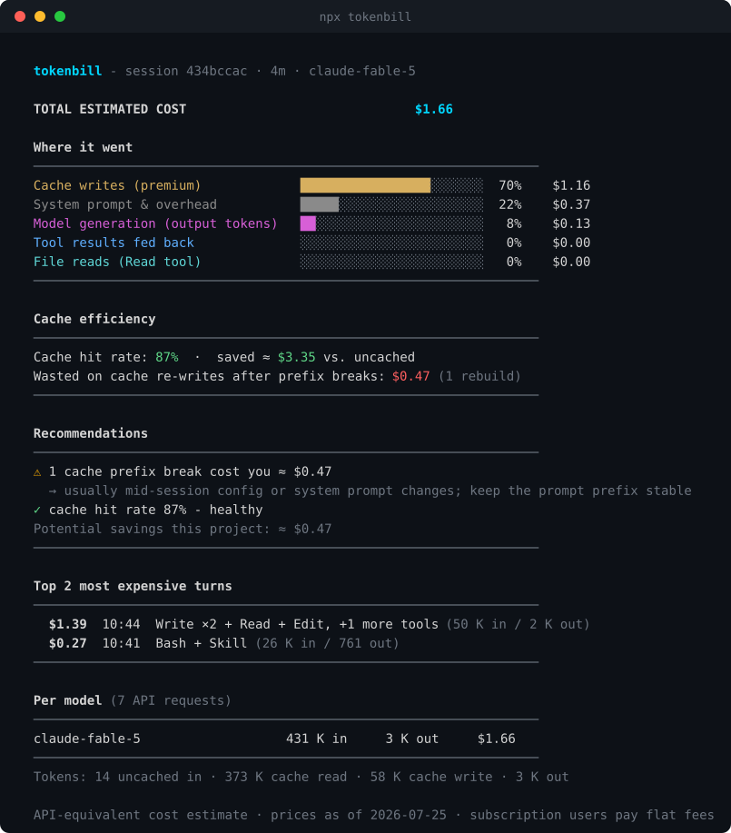

# tokenbill

**Where did my AI budget go?**

Claude Code sessions cost real money and you get zero visibility into why.
`tokenbill` reads the session logs already on your disk and gives you the bill,
itemized. No network calls, no config, no account.



```
$ npx tokenbill

  tokenbill - session 1d6eedb6 · 29m · claude-fable-5

  TOTAL ESTIMATED COST                              $32.25

  Where it went
  ──────────────────────────────────────────────────────────────────
  System prompt & overhead           ████████████████░░░░░░░░  65%   $21.04
  Context compaction                 █████░░░░░░░░░░░░░░░░░░░  20%    $6.29
  Model generation (output tokens)   ██░░░░░░░░░░░░░░░░░░░░░░   9%    $3.04
  Cache writes (premium)             █░░░░░░░░░░░░░░░░░░░░░░░   5%    $1.66
  ──────────────────────────────────────────────────────────────────

  Cache efficiency
  ──────────────────────────────────────────────────────────────────
  Cache hit rate: 98%  ·  saved ≈ $191 vs. uncached
  Wasted on cache re-writes after prefix breaks: $3.14 (1 rebuild)
  ──────────────────────────────────────────────────────────────────

  Recommendations
  ──────────────────────────────────────────────────────────────────
  ⚠ 1 cache prefix break cost you ≈ $3.14
    → usually mid-session config or system prompt changes; keep the prompt prefix stable
  ✓ cache hit rate 98% - healthy
  Potential savings this project: ≈ $3.14
  ──────────────────────────────────────────────────────────────────
```

*(Real output from a real session - yes, that half-hour cost $32 in API-equivalent terms, and $21 of it was re-reading the system prompt from cache on every request.)*

## Install & run

```
cd your-project && npx tokenbill   # every Claude Code session of this project, aggregated
npx tokenbill <project-dir>        # same, for any project (source dir or log dir both work)
npx tokenbill <session.jsonl>      # deep-dive report for one specific session
```

Run it from a project directory and you get the full bill for that project -
per-session totals, combined categories, and the most expensive moments across
all sessions. Run it anywhere else and it falls back to your most recent
session. Zero configuration either way.

Options:

```
--json            machine-readable output (schemaVersion 2)
--html [file]     shareable single-file HTML report (default: tokenbill-report.html)
--top <n>         number of expensive turns to show (default 10)
--budget <usd>    exit 2 if the total exceeds this amount (for CI)
--pricing <file>  override the built-in price table with your own JSON
--no-color        disable colored output (NO_COLOR env also respected)
```

### Budget guard in CI

`--budget` still prints the full report, then exits `2` if you're over. Drop it into
a workflow to fail the build when a project's spend crosses a line:

```yaml
- run: npx tokenbill . --budget 25
```

Exit codes: `0` ok, `1` error, `2` budget exceeded.

## What it tells you

- **Total estimated cost** - token usage from the logs × current per-token prices, deduplicated per API request, priced per model (mixed-model sessions work), cache reads at 0.1×, cache writes at their 5-minute (1.25×) or 1-hour (2×) premium, plus per-request server tool charges.
- **Where it went** - output generation vs. tool results vs. file reads vs. system overhead vs. cache-write premiums vs. context compaction vs. server tools, attributed by an incremental-delta heuristic. Categories always sum exactly to the total.
- **Server tools** - web searches billed per request ($10 per 1,000), counted alongside the token costs they generate. Web fetch has no per-request charge, so it shows its call count and contributes only the tokens the fetched content adds.
- **Compaction events** - when your context got summarized mid-session, what it cost, and how many tokens of history were dropped.
- **Cache efficiency** - hit rate, dollars saved vs. running uncached, and dollars wasted on mid-session cache rebuilds (the signature of a broken prompt prefix).
- **Top expensive turns** - the moments that actually burned the budget, each with a one-line description of what happened.
- **Recommendations** - actionable findings with dollar impact: cache prefix breaks, file-read-heavy sessions, expensive compactions, low hit rates, plus an honest "potential savings" estimate.
- **Daily spend trend** - a sparkline and per-day breakdown of the last 14 days (project reports), so you can see spend habits over time.
- **Shareable HTML report** - `--html` writes the whole report as one self-contained dark-theme HTML file (no external requests, sortable turn table) you can open, screenshot, or send to your team.

## Honest caveats

- The dollar figure is an **API-equivalent estimate**. If you're on a Claude subscription (Pro/Max), you pay a flat fee - this number tells you what your usage would cost at API rates, which is still the right signal for spotting waste.
- Category attribution is a documented heuristic, not exact accounting.
- Prices change. The table ships with an `asOf` date (printed in every report footer) and is refreshed with `npm run pricing:sync` - see [CONTRIBUTING.md](CONTRIBUTING.md#updating-pricing). Rates have effective dates, so a session is priced at the rate it was actually billed at - including promotional windows like Sonnet 5's introductory $2/$10. `--pricing` still overrides everything without waiting for a release.
- A model with no published rate is **flagged, not guessed at**: it's priced at fallback Sonnet rates and the report marks it (`~unknown model, sonnet rates`).
- Fast mode (`usage.speed`) is priced at its premium and the batch service tier at its discount. Priority tier is billed as standard - if you use it, the total is understated.
- Server tool pricing assumes the standard published rates. Errored web searches aren't billed by the API and don't appear in the logs as charged requests, so they're not counted here either.

## Privacy

`tokenbill` never makes a network call. It reads local files and prints text. The test fixtures in this repo are anonymized (same-length placeholder text; structure, token counts and tool names preserved) via [`scripts/anonymize.ts`](scripts/anonymize.ts).

That holds even for pricing: [`scripts/sync-pricing.ts`](scripts/sync-pricing.ts) is run manually to refresh the table, and its output is committed as source. The published package contains `dist` only, so there is no fetch path at runtime, no cache directory, and nothing to opt out of.

## Supported agents

Claude Code today. The parser is an adapter interface (`src/adapters/`) - Codex/Cursor/Aider adapters are welcome contributions.

## Development

```
npm install
npm test          # vitest: unit + golden-file snapshot tests
npm run build     # tsc → dist/
npm run dev       # tsx src/cli.ts
npm run demo      # regenerate assets/demo.svg from fixtures/basic.jsonl

npm run pricing:sync    # refresh the price table from upstream (the only network call)
npm run pricing:audit   # validate the shipped table offline
```

Type-checking is three projects, and CI runs all three - `tsx` and `vitest` both
transpile without checking, so the scripts and the test suite are only covered by
their own configs:

```
npx tsc --noEmit                          # src/ (the build project)
npx tsc --noEmit -p scripts/tsconfig.json # dev scripts
npx tsc --noEmit -p test/tsconfig.json    # test suite
```

See [CONTRIBUTING.md](CONTRIBUTING.md#updating-pricing) before touching prices -
`src/cost/prices.generated.ts` is generated, and hand-curated facts belong in
`src/cost/pricing.overrides.json`. [CONTRIBUTING.md](CONTRIBUTING.md) also covers
adapter contributions.

Licensed under the [MIT License](LICENSE).
